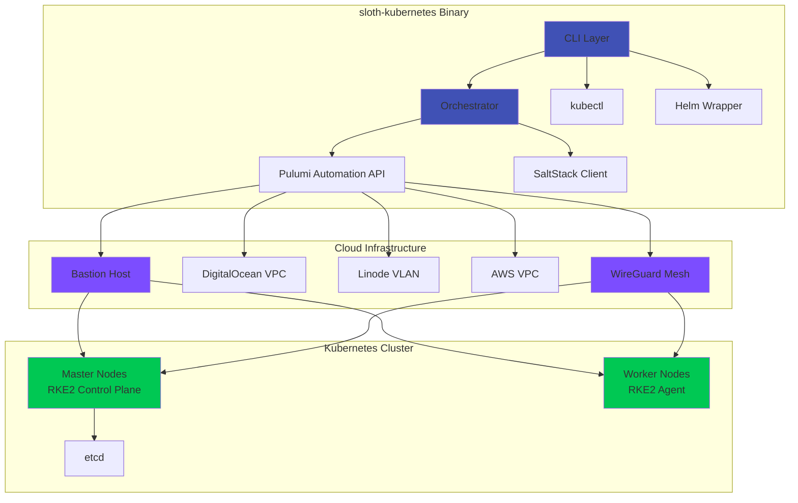

# sloth-kubernetes

<div class="hero" markdown="block">

## Multi-Cloud Kubernetes Orchestration in a Single Binary

Deploy secure, production-grade Kubernetes clusters across **DigitalOcean**, **Linode**, **AWS**, **Azure**, and **GCP** with unified configuration, automated orchestration, and zero external dependencies.

[Get Started](getting-started/installation.md){ .md-button .md-button--primary }
[View on GitHub](https://github.com/chalkan3/sloth-kubernetes){ .md-button }

</div>

---

## What is sloth-kubernetes?

**sloth-kubernetes** eliminates the complexity of multi-cloud Kubernetes deployment by embedding **infrastructure provisioning**, **configuration management**, and **Kubernetes tooling** into a single binary. No Pulumi CLI, no Terraform, no Ansible - just one executable.

### Five Essential Tools, Zero Dependencies

<div class="grid cards" markdown>

-   :fontawesome-solid-layer-group: **Pulumi Automation API**

    ---

    Infrastructure as Code **embedded** in the binary. No external Pulumi CLI required. Provision VPCs, droplets, VPNs, and DNS across clouds programmatically.

-   :fontawesome-solid-server: **SaltStack Integration**

    ---

    **100+ remote operations** for node management, including cmd.run, pkg.install, service.restart, grains, state.apply, and complete minion lifecycle.

-   :material-kubernetes: **kubectl Embedded**

    ---

    Complete Kubernetes CLI **built-in**. Manage workloads, inspect resources, debug pods - all through `sloth-kubernetes kubectl`.

-   :fontawesome-solid-dharmachakra: **Helm Support**

    ---

    Chart management and deployments via optional wrapper. Install, upgrade, rollback Helm releases seamlessly.

-   :fontawesome-solid-boxes-stacked: **Kustomize**

    ---

    Configuration customization for Kubernetes manifests. Build, apply, and manage overlays.

</div>

---

## Complete Feature Set

### :material-cloud-outline: Multi-Cloud Infrastructure

Deploy across **5 cloud providers** with unified LISP configuration:

- **DigitalOcean** - Droplets, VPCs, Floating IPs, Cloud Firewalls
- **Linode** - Instances, VLANs, NodeBalancers
- **AWS** - EC2, VPC, Route53 (coming soon)
- **Azure** - VMs, VNets, Load Balancers (coming soon)
- **GCP** - Compute Engine, VPC, Cloud DNS (coming soon)

### :fontawesome-solid-shield-halved: Security-First Architecture

=== "Bastion Host"

    **Centralized secure access** with:

    - SSH jump host for private cluster access
    - MFA support via Google Authenticator
    - Complete SSH session audit logging
    - Automated SSH key distribution
    - No direct public access to cluster nodes

=== "WireGuard VPN Mesh"

    **Encrypted cross-cloud networking**:

    - Automatic WireGuard tunnel creation between all nodes
    - Full mesh topology for HA and performance
    - Private IP routing across cloud providers
    - UDP hole-punching for NAT traversal
    - Automatic endpoint discovery

=== "Hardened Kubernetes"

    **RKE2 with security compliance**:

    - CIS Kubernetes Benchmark alignment
    - RBAC enabled by default
    - Network Policies for pod isolation
    - TLS encryption for all control plane communication
    - etcd encryption at rest

### :fontawesome-solid-terminal: 50+ CLI Commands

Comprehensive command-line interface organized by function:

=== "Cluster Lifecycle"

    ```bash
    sloth-kubernetes deploy --config cluster.lisp
    sloth-kubernetes destroy
    sloth-kubernetes refresh
    sloth-kubernetes preview
    sloth-kubernetes validate --config cluster.lisp
    ```

=== "Node Management"

    ```bash
    sloth-kubernetes nodes list
    sloth-kubernetes nodes ssh <name>
    sloth-kubernetes nodes add --pool workers --count 2
    sloth-kubernetes nodes remove <name>
    sloth-kubernetes nodes drain <name>
    sloth-kubernetes nodes cordon <name>
    ```

=== "Stack Operations"

    ```bash
    sloth-kubernetes stacks list
    sloth-kubernetes stacks info
    sloth-kubernetes stacks select <name>
    sloth-kubernetes stacks delete <name>
    sloth-kubernetes stacks export
    sloth-kubernetes stacks import
    sloth-kubernetes stacks output
    ```

=== "SaltStack (100+ operations)"

    ```bash
    sloth-kubernetes salt ping
    sloth-kubernetes salt minions
    sloth-kubernetes salt cmd.run "uptime"
    sloth-kubernetes salt pkg.install nginx
    sloth-kubernetes salt service.restart kubelet
    sloth-kubernetes salt grains.items
    sloth-kubernetes salt state.apply
    sloth-kubernetes salt keys list
    ```

=== "Kubernetes Tools"

    ```bash
    sloth-kubernetes kubeconfig
    sloth-kubernetes kubectl get nodes
    sloth-kubernetes kubectl apply -f manifest.yaml
    sloth-kubernetes helm install nginx bitnami/nginx
    sloth-kubernetes kustomize build overlays/prod
    ```

=== "GitOps & Addons"

    ```bash
    sloth-kubernetes addons bootstrap
    sloth-kubernetes addons list
    sloth-kubernetes addons sync
    sloth-kubernetes addons status
    sloth-kubernetes addons template <name>
    ```

### :fontawesome-solid-diagram-project: Automated 8-Phase Orchestration


1. **SSH Key Management** - Generate and distribute keys to all providers
2. **Bastion Deployment** - Create secure jump host with audit logging
3. **VPC Creation** - Provision virtual networks in each cloud
4. **WireGuard Mesh** - Establish encrypted VPN between all nodes
5. **Node Provisioning** - Deploy master and worker nodes with cloud-init
6. **RKE2 Installation** - Bootstrap secure Kubernetes control plane
7. **VPN Configuration** - Configure WireGuard endpoints and routing
8. **DNS Setup** - Configure DNS for cluster services

### :material-git: GitOps with ArgoCD

Manage cluster addons declaratively with Git-based workflows:

```lisp
(addons
  (argocd
    (enabled true)
    (version "v2.9.0")
    (repository "https://github.com/your-org/k8s-addons")
    (path "clusters/production")
    (sync-policy
      (automated true)
      (prune true)
      (self-heal true))))
```

Automatically deploys:

- ArgoCD server and controller
- Application CRDs for addon management
- Automated sync from Git repositories
- Self-healing for drift detection

---

## Quick Start

=== "Linux"

    ```bash
    curl -sSL https://github.com/chalkan3/sloth-kubernetes/releases/latest/download/sloth-kubernetes-linux-amd64 -o sloth-kubernetes
    chmod +x sloth-kubernetes
    sudo mv sloth-kubernetes /usr/local/bin/
    ```

=== "macOS"

    ```bash
    curl -sSL https://github.com/chalkan3/sloth-kubernetes/releases/latest/download/sloth-kubernetes-darwin-amd64 -o sloth-kubernetes
    chmod +x sloth-kubernetes
    sudo mv sloth-kubernetes /usr/local/bin/
    ```

=== "Windows"

    ```powershell
    curl -sSL https://github.com/chalkan3/sloth-kubernetes/releases/latest/download/sloth-kubernetes-windows-amd64.exe -o sloth-kubernetes.exe
    ```

### Deploy Your First Cluster

```lisp title="cluster.lisp"
; Minimal production cluster configuration
(cluster
  (metadata
    (name "production")
    (environment "production"))

  (providers
    (digitalocean
      (enabled true)
      (token "${DIGITALOCEAN_TOKEN}")
      (region "nyc3")
      (vpc
        (create true)
        (cidr "10.10.0.0/16"))))

  (network
    (mode "wireguard")
    (wireguard
      (enabled true)
      (create true)
      (mesh-networking true)))

  (node-pools
    (masters
      (name "masters")
      (provider "digitalocean")
      (count 3)
      (roles master etcd)
      (size "s-2vcpu-4gb"))
    (workers
      (name "workers")
      (provider "digitalocean")
      (count 5)
      (roles worker)
      (size "s-4vcpu-8gb")))

  (kubernetes
    (distribution "rke2")
    (version "v1.29.0+rke2r1")))
```

```bash
export DIGITALOCEAN_TOKEN="your-digitalocean-token"
sloth-kubernetes deploy --config cluster.lisp
```

---

## Architecture Deep Dive

### Component Overview



### Key Architectural Components

<div class="grid cards" markdown>

-   **Cluster Orchestrator** (`internal/orchestrator/cluster_orchestrator.go`)

    ---

    Manages complete deployment lifecycle with 8 sequential phases. Handles component dependencies, error recovery, and state management.

-   **Node Deployment** (`internal/orchestrator/components/node_deployment.go`)

    ---

    Multi-cloud node provisioner supporting DO, Linode, AWS, Azure, GCP. Generates cloud-init configs, manages SSH keys, configures networking.

-   **Bastion Manager** (`internal/orchestrator/components/bastion.go`)

    ---

    Deploys secure jump host with MFA, SSH audit logging, and key distribution. Single point of access for all private nodes.

-   **WireGuard Mesh** (`internal/orchestrator/components/wireguard_mesh.go`)

    ---

    Creates encrypted VPN mesh topology. Generates keys, configures endpoints, establishes tunnels between all nodes across clouds.

-   **RKE2 Installer** (`internal/orchestrator/components/rke2_installer.go`)

    ---

    Bootstraps RKE2 Kubernetes distribution with security hardening, HA control plane, and automatic etcd backups.

-   **DNS Manager** (`internal/orchestrator/components/dns_manager.go`)

    ---

    Configures DNS records for cluster services. Supports cloud provider DNS (Route53, Cloud DNS, Azure DNS).

-   **VPC Manager** (`internal/orchestrator/components/vpc.go`)

    ---

    Creates virtual networks in each cloud provider. Manages CIDR allocation, subnet creation, and routing tables.

-   **Firewall Manager** (`internal/orchestrator/components/firewall.go`)

    ---

    Configures security groups and firewall rules. Restricts access to bastion, allows WireGuard UDP, secures K8s API.

</div>

---

## Production Use Cases

### Distributed High Availability

Deploy masters across **3 cloud providers** for maximum resilience:

```lisp
(node-pools
  (do-masters
    (name "do-masters")
    (provider "digitalocean")
    (count 1)
    (roles master etcd)
    (size "s-2vcpu-4gb")
    (region "nyc3"))
  (linode-masters
    (name "linode-masters")
    (provider "linode")
    (count 1)
    (roles master etcd)
    (size "g6-standard-2")
    (region "us-east"))
  (aws-masters
    (name "aws-masters")
    (provider "aws")
    (count 1)
    (roles master etcd)
    (size "t3.medium")
    (region "us-east-1")))
```

**Result**: Cluster survives complete cloud provider outage.

### Cost Optimization

Mix instance types across clouds for optimal price/performance:

```lisp
(node-pools
  (spot-workers
    (name "spot-workers")
    (provider "aws")
    (count 10)
    (roles worker)
    (size "t3.large")
    (spot-instance true)
    (spot-max-price "0.05"))  ; 70% cost savings
  (stable-workers
    (name "stable-workers")
    (provider "digitalocean")
    (count 3)
    (roles worker)
    (size "s-4vcpu-8gb")))  ; Guaranteed availability
```

### Disaster Recovery

Maintain standby cluster in different geographic region:

```lisp
(cluster
  (metadata
    (name "dr-cluster")
    (environment "disaster-recovery"))
  (providers
    (aws
      (enabled true)
      (region "eu-west-1"))))
```

Sync data with ArgoCD GitOps and automated backups.

---

## Comparison Matrix

| Feature | sloth-kubernetes | Terraform + Ansible | Raw Pulumi | Rancher |
|---------|------------------|---------------------|------------|---------|
| **Single Binary** | ✅ All-in-one | ❌ 3+ tools | ❌ Requires CLI | ❌ Server required |
| **kubectl Embedded** | ✅ Built-in | ❌ External | ❌ External | ✅ Web UI |
| **Multi-Cloud VPN** | ✅ Automated | ⚠️ Manual | ⚠️ Manual | ❌ Not included |
| **SaltStack** | ✅ 100+ ops | ❌ | ❌ | ❌ |
| **GitOps (ArgoCD)** | ✅ Integrated | ⚠️ Separate | ⚠️ Separate | ⚠️ Fleet |
| **Bastion Host** | ✅ Auto-deploy | ⚠️ Manual | ⚠️ Manual | ❌ |
| **Stack Management** | ✅ Multiple clusters | ⚠️ Workspaces | ✅ Stacks | ✅ Clusters |
| **Security Hardening** | ✅ CIS-aligned | ⚠️ Manual | ⚠️ Manual | ✅ |
| **Learning Curve** | Low | High | Medium | Medium |

---

## Community & Resources

<div class="grid cards" markdown>

-   :fontawesome-brands-github: **GitHub**

    ---

    [Issues](https://github.com/chalkan3/sloth-kubernetes/issues) · [Discussions](https://github.com/chalkan3/sloth-kubernetes/discussions) · [Releases](https://github.com/chalkan3/sloth-kubernetes/releases)

-   :fontawesome-brands-docker: **Docker Hub**

    ---

    [Container Images](https://hub.docker.com/r/chalkan3/sloth-kubernetes)

-   :material-book-open-variant: **Documentation**

    ---

    [Getting Started](getting-started/installation.md) · [User Guide](user-guide/index.md) · [Architecture](architecture/index.md)

-   :material-license: **License**

    ---

    [MIT License](https://github.com/chalkan3/sloth-kubernetes/blob/main/LICENSE)

</div>

---

## Next Steps

Ready to deploy your first cluster?

[Installation Guide](getting-started/installation.md){ .md-button .md-button--primary }
[Quick Start Tutorial](getting-started/quickstart.md){ .md-button }
[View Examples](user-guide/index.md){ .md-button }
